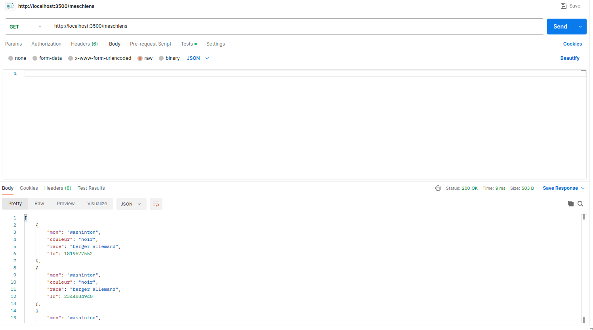
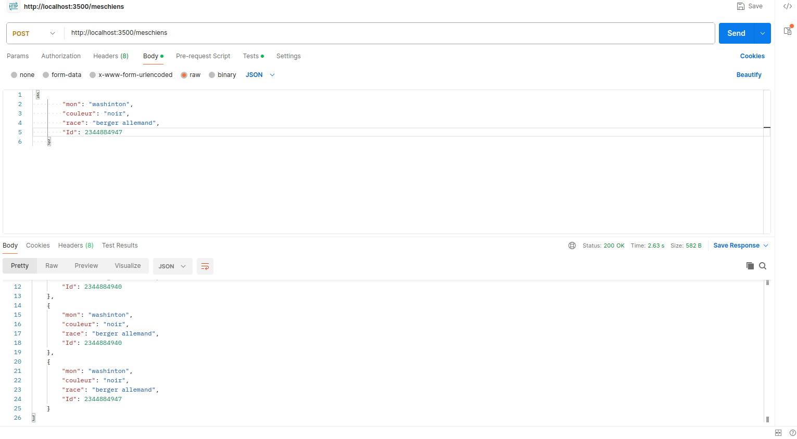

# Réalisation d'une API CRUD

## But du projet

Le but de ce projet est de créer une API CRUD (Create, Read, Update, Delete) en utilisant Express.

### Fonctionnalités

- **Create** (Créer) : Permet de créer de nouvelles entités dans l'API.
- **Read** (Lire) : Permet de récupérer les informations des entités existantes dans l'API.
- **Update** (Mettre à jour) : Permet de modifier les informations des entités existantes dans l'API.
- **Delete** (Supprimer) : Permet de supprimer les entités existantes de l'API.

## Avancement du projet

Les fonctionnalités suivantes ont été réalisées jusqu'à présent :

- **GET** : Lecture des informations des entités.

- **POST** : Création de nouvelles entités.

## Technologies utilisées

- Node.js
- Express.js

## Outils utilisés

- Visual Studio Code
- Postman